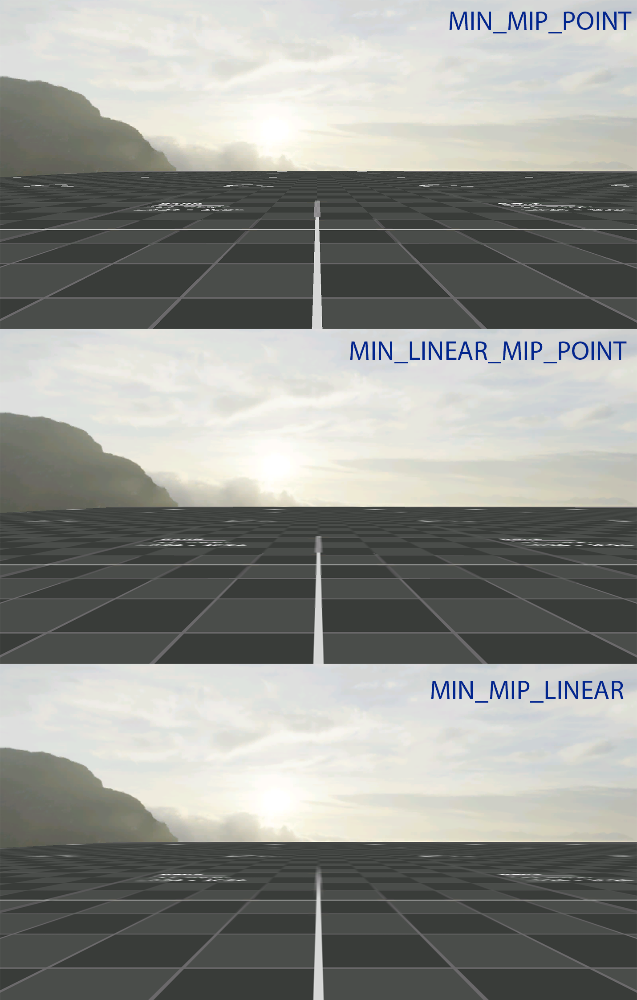
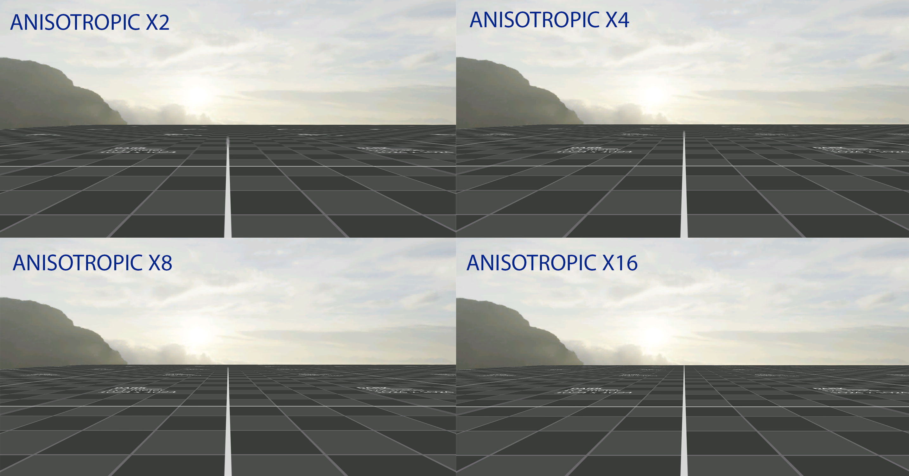
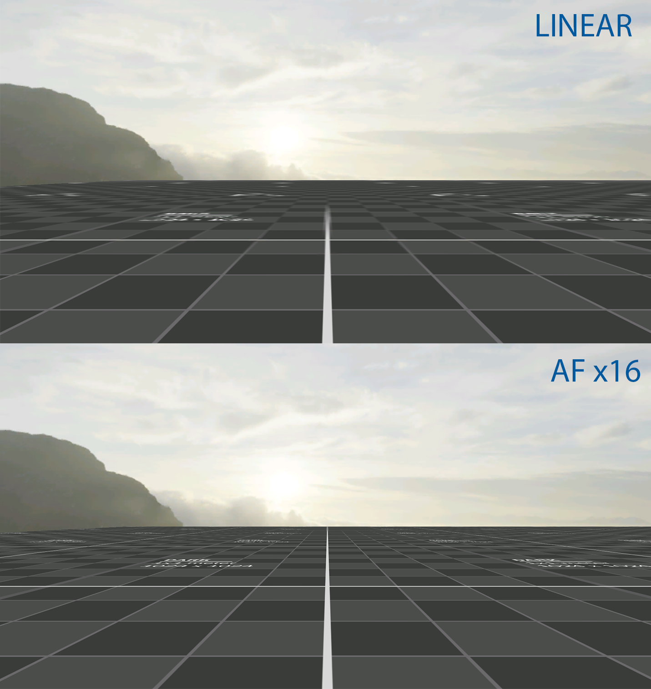
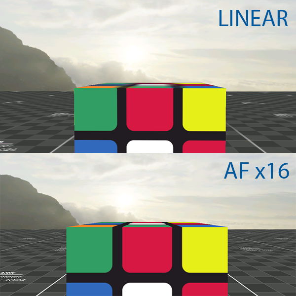

# CONTROLS

| KEY                              | ACTION                                                       |
| -------------------------------- | ------------------------------------------------------------ |
| W                                | Move forward                                                 |
| S                                | Move backward                                                |
| A                                | Move left                                                    |
| D                                | Move right                                                   |
| Q                                | Move up                                                      |
| E                                | Move down                                                    |
| SHIFT                            | Acceleration                                                 |
| Mouse Scroll Forward             | Increase movement speed                                      |
| Mouse Scroll Backward            | Decrease movement speed                                      |
| R                                | Rotate grabbed object left                                   |
| T                                | Rotate grabbed object right                                  |
| +                                | Increase EV100 value                                         |
| -                                | Decrease EV100 value                                         |
| Left Mouse Button hold and drag  | Rotate camera (rotate speed depends on offset from center of the screen) |
| Right Mouse Button hold and drag | Grab and move object                                         |
| N                                | Spawn knight                                                 |

# TEXTURE FILTERING

## MAGNIFICATION

## MINIFICATION

## ANISOTROPIC

## ANISOTROPIC X16 vs LINEAR

